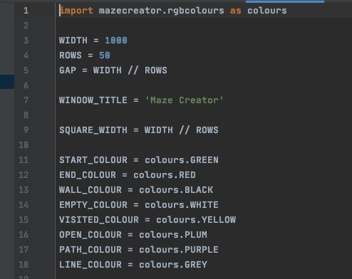
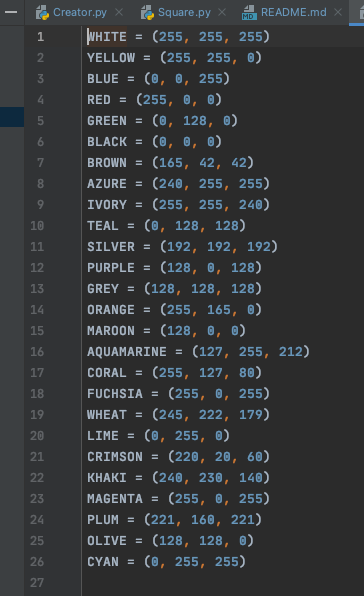
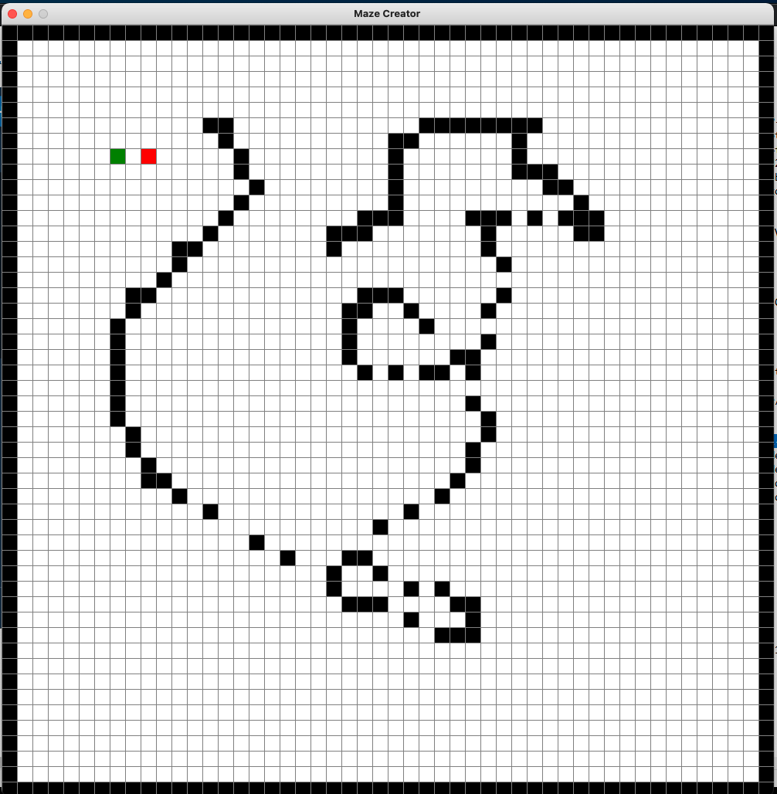
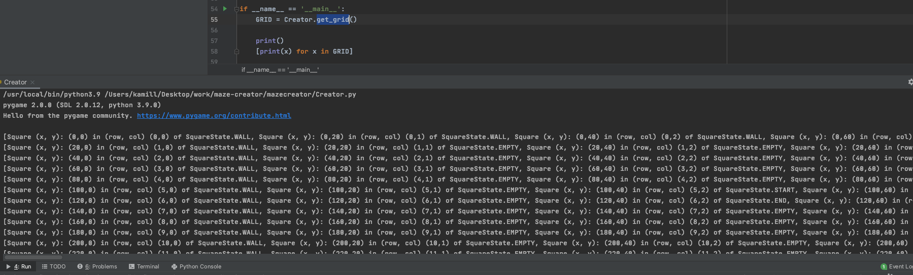

# maze-creator
Simple grid maze creator
# settings
To configure change mazecreator/settings.py

- Colours can be configured in mazecreator/rgbcolours.py
    - define name and provide RGB value in 3-tuple (R, G, B)
    
    
# creating a maze(2D grid)
To create a maze call get_grid() from mazecreator.Creator
- returns a 2D list [[], []] of mazecreator.Square objects
- that will open a drawing grid

- LEFT mouse click places (start position, end position, wall)
- RIGHT mouse click removes 
    - default colours:
        - BLACK - wall
        - GREEN - start position
        - RED - end position
- to quit ESC on keyboard or X on the window
- to export the GRID press ENTER

# ENJOY